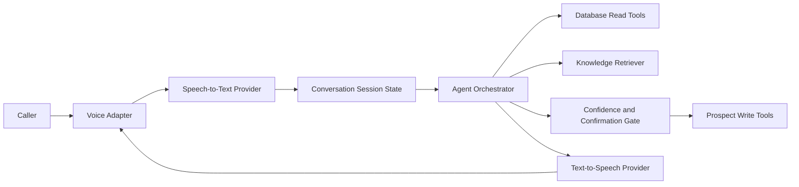
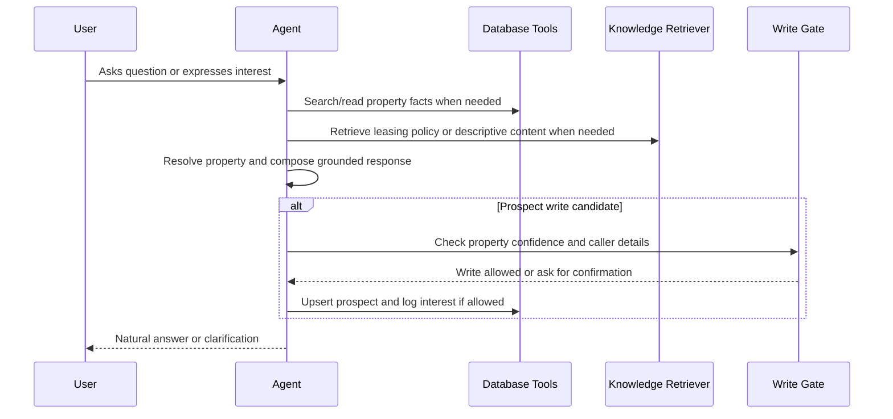
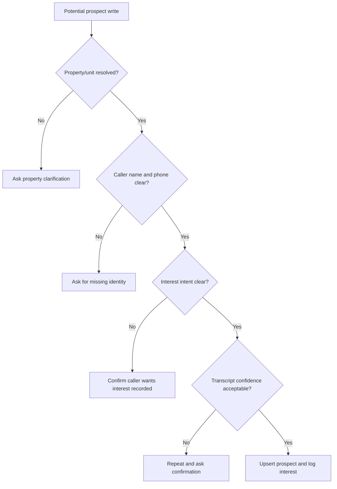

# Architecture

## Summary

The MVP should be a small, testable voice-agent system centered on a leasing conversation. The assistant resolves the property, answers grounded questions from database and knowledge-base tools, and writes prospect interest only after confidence or explicit confirmation.

The brief suggests Python and FastAPI, Twilio for telephony, and Strands Agents SDK as a plus. Those are strong candidates, but final technology choices require ADRs before implementation.

## High-Level Components

Implemented M02 boundaries:

- Settings live in `leasing_voice_assistant.config` and read `LVA_`-prefixed environment variables from the environment or local `.env`.
- Provider and storage contracts live in `leasing_voice_assistant.interfaces`.
- Deterministic local fakes live in `leasing_voice_assistant.fakes` for tests and future offline integration work.

Implemented M03 persistence:

- SQLite schema migrations live in `data/migrations/`.
- Synthetic property and unit seed data lives in `data/seeds/properties.json`.
- Runtime SQLite files are generated under `data/runtime/` and are not committed.
- `leasing_voice_assistant.persistence` applies migrations, loads seed data idempotently, and provides concrete SQLite property and prospect repositories.
- Prospect upsert matches normalized phone numbers, and interest logging is idempotent for the same prospect, source, and resolved target.

Implemented M04 database query tools:

- `leasing_voice_assistant.database_tools` exposes a read-only tool layer over `PropertyRepository`.
- Tool request and response DTOs cover property search, unit listing, and unit fact lookup.
- Responses include structured `EvidenceItem` records, result counts, enforced limits, and conservative match metadata.
- The tool layer does not expose raw SQL and does not perform prospect writes.

Implemented M05 knowledge-base retrieval:

- Markdown knowledge-base source files live in `data/kb/`.
- `leasing_voice_assistant.knowledge_base` parses Markdown documents into stable source sections.
- `MarkdownKnowledgeRetriever` implements the `KnowledgeRetriever` protocol with deterministic lexical retrieval.
- Retrieval responses return source IDs, titles, section headings, bounded snippets, scores, and metadata.
- The knowledge base stays separate from database-owned unit facts and does not perform answer generation or writes.

Recommended MVP boundaries:

- Voice adapter: browser voice loop first if telephony is blocked; Twilio adapter later if credentials are available.
- STT/TTS/model providers: abstracted behind interfaces so tests can use deterministic fakes.
- Database: local relational store for properties, units, prospects, and interests.
- Knowledge base: separate document source with retrieval interface.
- Agent orchestration: central turn handler that chooses tools, tracks state, and produces grounded responses.

## Voice And Audio Pipeline

The voice path should support two implementations:

- Browser voice loop: microphone input, speech recognition or streamed audio to backend, spoken assistant responses, and an easy demo path.
- Twilio inbound call: inbound number, media streaming, backend websocket, STT/TTS, and response audio back to the call.

Browser voice is the recommended fallback if Twilio credentials, trial numbers, public tunneling, or latency constraints block real telephony. A real phone call remains ideal evidence if feasible.

## Conversation And Session State

Each conversation should maintain:

- Session or call ID.
- Caller phone number when available.
- Latest transcript turns.
- Resolved property/unit candidate and confidence.
- Caller name, phone, and optional email capture state.
- Prospect-write readiness state.
- Tool evidence used for the latest answer.
- Error and fallback state.

Session state should be serializable enough for tests and logs.

## Agent Orchestration

The agent should:

- Route factual property questions to database tools.
- Route policies, FAQs, lease terms, and richer descriptions to KB retrieval.
- Ask clarifying questions for ambiguous property references.
- Refuse or qualify answers when evidence is missing.
- Avoid writes until the property and caller details are clear.

## Database Read Tools

Database tools should expose narrow operations, not raw SQL to the model:

- `search_properties` searches properties by repository-backed text query and returns candidates with `exact`, `high`, or `possible` confidence.
- `list_units` lists units for a known property ID with availability and unit facts.
- `get_unit_facts` reads one unit by ID and returns rent, bedrooms, bathrooms, square footage, availability, view, parking, pet policy, amenities, and status.
- All tool responses include structured source labels such as `database.properties` and `database.units` for grounding.

## Knowledge-Base Retrieval

The implemented KB covers:

- Property factsheets.
- General leasing FAQ.
- Application process.
- Deposits, lease terms, pet rules, and other policies.

ADR 0005 selects committed Markdown source files and deterministic lexical retrieval for the MVP. The retriever splits documents by headings and returns source-attributed snippets rather than final prose. Embeddings remain an optional future upgrade if evaluation shows that lexical retrieval misses important paraphrases.

## Property Resolution

Property resolution should combine:

- Explicit mentions from the caller.
- Database search results.
- Conversation history.
- Unit details such as bedrooms, view, rent, or availability.
- Confirmation when confidence is low.

Ambiguous references such as "the lake-facing one" or "that two bedroom" must not trigger writes until resolved.

## Prospect Identity Capture

The assistant should capture:

- Phone number, preferably from telephony metadata when available.
- Caller name.
- Optional email only if naturally offered or needed by implementation.

For browser voice, phone number may need to be spoken or manually supplied in the test harness. The assistant should repeat critical details before writing when transcription quality is uncertain.

## Confidence And Confirmation Gate

The gate should prevent:

- Writes from garbled speech.
- Registration before user intent is clear.
- Interest logged against an ambiguous property.
- Duplicate prospect records when phone number matches.
- Duplicate interest rows for the same prospect/unit unless the design explicitly allows history.

## Prospect Upsert And Interest Logging

The MVP should:

- Match existing prospects by phone number.
- Update name if appropriate and safe.
- Create a new prospect if no phone match exists.
- Log interest in the resolved unit or property.
- Make interest creation idempotent for repeated confirmations in the same conversation.

ADR 0003 defines the storage-level idempotency rule: interest rows are unique for the same prospect, source, and target unit or property. Later safe-capture logic can still decide when a write is allowed.

## Observability And Structured Logging

Logs should include:

- Session ID.
- Turn number.
- Tool calls and result counts.
- Property-resolution confidence.
- Write-gate decisions.
- Latency timings for STT, model, TTS, and end-to-end turn response.
- Errors and fallback paths.

Logs must avoid secrets and unnecessary personal data.

## Testing Strategy

Use layered verification:

- Unit tests for property resolution, write gate, database tools, KB retrieval, and prospect upsert.
- Integration tests for text conversation scenarios.
- Fake STT/TTS/model providers for deterministic voice pipeline tests.
- Optional contract tests for real provider adapters without making live calls by default.
- End-to-end manual demo for browser voice or telephony.

## Evaluation Strategy

Create a small scenario set covering:

- Known property fact questions.
- KB policy questions.
- Ambiguous property references.
- Unknown questions.
- Caller identity capture.
- Duplicate prospect update.
- Garbled or low-confidence write attempts.
- Conflicting DB and KB facts.
- Stale availability.

An optional LLM-as-judge can score groundedness, helpfulness, and safety, but deterministic assertions should cover core writes and tool behavior first.

## Local Development Flow

Current local development commands:

1. Install dependencies with `uv sync --all-groups`.
2. Run automated tests with `uv run pytest`.
3. Run linting with `uv run ruff check .`.
4. Run formatting checks with `uv run ruff format --check .`.
5. Run type checks with `uv run mypy`.
6. Run the scaffold app with `uv run uvicorn --app-dir src leasing_voice_assistant.app:create_app --factory --reload`.
7. Initialize the local SQLite database with `PYTHONPATH=src uv run python -c "from leasing_voice_assistant.persistence import initialize_database; initialize_database().close()"`.
8. Edit or review Markdown KB content under `data/kb/`.

Later milestones will add property resolution, text conversation harness, browser voice or telephony adapter, and demo recording commands.

## Deployment And Demo Flow

The MVP should support a clean local demo. If Twilio is used, document:

- Required Twilio credentials.
- Phone number setup.
- Public webhook or tunnel.
- Media streaming configuration.
- How to place the call.

If browser voice is used, document:

- Browser permissions.
- Required model/speech credentials.
- How to start the backend and browser client.
- How to record the demo.

## Security And Privacy

- Do not commit credentials.
- Use environment variables or ignored local env files.
- Avoid logging full transcripts when not necessary.
- Redact phone numbers in shared logs where practical.
- Keep demo data synthetic.
- Document all external provider requirements.

## Failure Handling

The assistant should:

- Ask for clarification when property resolution is ambiguous.
- Say it does not know when neither DB nor KB has an answer.
- Prefer database facts over KB facts for current unit availability and rent.
- Surface conflicting facts conservatively.
- Retry or apologize briefly on provider failures.
- Avoid writes if transcription confidence is low.

## Provider Boundaries And Interfaces

Implemented M02 interfaces:

- `ModelProvider`: generate agent decisions/responses.
- `SpeechToTextProvider`: convert audio to transcript with confidence metadata when available.
- `TextToSpeechProvider`: synthesize response audio.
- `VoiceSessionProvider`: browser or telephony session transport.
- `PropertyRepository`: property/unit reads.
- `ProspectRepository`: prospect upsert and interest logging.
- `KnowledgeRetriever`: retrieve KB snippets.

These interfaces should stay small and practical; avoid building a generic framework.

## Important Trade-Offs

- Browser voice is easier to demo reliably; Twilio is closer to the ideal assignment evidence.
- SQLite is simple for clean-checkout local use; Postgres is closer to production but adds setup overhead.
- Lightweight KB retrieval is faster to build; embeddings may improve semantic matching but add provider and indexing complexity.
- Direct agent orchestration is easier to control; Strands may be a plus but adds dependency and learning risk.
- Strict write confirmation improves safety but can make the conversation feel less fluid.

## Alternatives Considered

- Twilio-first implementation: strong real-call evidence, but higher credential and networking risk.
- Browser-first implementation: lower setup risk, still acceptable under the brief if genuinely voice-to-voice.
- Postgres: robust, but unnecessary for one or two properties unless selected for familiarity.
- Embedding vector store: useful for larger KBs, but likely optional for the MVP.
- Full CRM/admin UI: explicitly out of scope.

## Decisions Requiring ADRs

- Application stack, dependency manager, and quality tooling.
- Database/storage choice and migration approach.
- Provider interface shapes and configuration strategy.
- Agent orchestration framework, including whether to use Strands Agents SDK.
- Knowledge-base retrieval approach.
- Property resolution confidence model.
- Prospect write gate and idempotency policy.
- Voice integration path: browser, Twilio, or both.
- Evaluation and observability approach.
