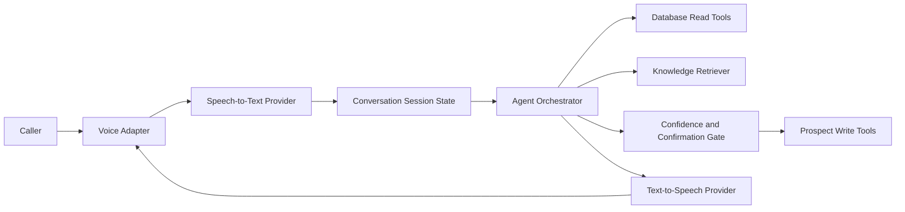
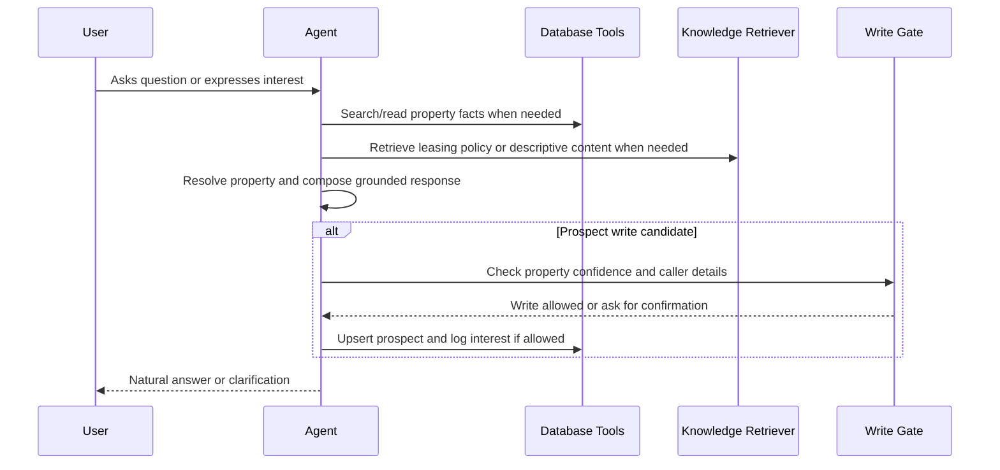
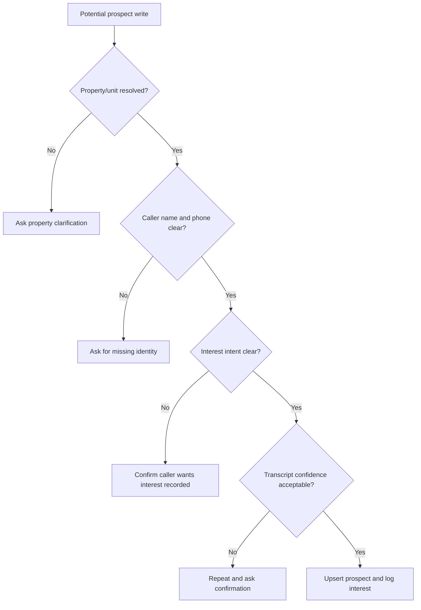

# Architecture

## Summary

The MVP should be a small, testable voice-agent system centered on a leasing conversation. The assistant resolves the property, answers grounded questions from database and knowledge-base tools, and writes prospect interest only after confidence or explicit confirmation.

The brief suggests Python and FastAPI, Twilio for telephony, and Strands Agents SDK as a plus. Those are strong candidates, but final technology choices require ADRs before implementation.

## High-Level Components



Implemented M02 boundaries:

- Settings live in `leasing_voice_assistant.config` and read `LVA_`-prefixed environment variables from the environment or local `.env`.
- Provider and storage contracts live in `leasing_voice_assistant.interfaces`.
- Deterministic local fakes live in `leasing_voice_assistant.fakes` for tests and future offline integration work.

Implemented M03 persistence:

- SQLite schema migrations live in `data/migrations/`.
- Synthetic property and unit seed data lives in `data/seeds/properties.json`.
- Runtime SQLite files are generated under `data/runtime/` and are not committed.
- `leasing_voice_assistant.persistence` applies migrations, loads seed data idempotently, and provides concrete SQLite property and prospect repositories.
- Prospect upsert matches normalized phone numbers, and interest logging is idempotent for the same prospect, source, and resolved target.

Implemented M04 database query tools:

- `leasing_voice_assistant.database_tools` exposes a read-only tool layer over `PropertyRepository`.
- Tool request and response DTOs cover property search, unit listing, and unit fact lookup.
- Responses include structured `EvidenceItem` records, result counts, enforced limits, and conservative match metadata.
- The tool layer does not expose raw SQL and does not perform prospect writes.

Implemented M05 knowledge-base retrieval:

- Markdown knowledge-base source files live in `data/kb/`.
- `leasing_voice_assistant.knowledge_base` parses Markdown documents into stable source sections.
- `MarkdownKnowledgeRetriever` implements the `KnowledgeRetriever` protocol with deterministic lexical retrieval.
- Retrieval responses return source IDs, titles, section headings, bounded snippets, scores, and metadata.
- The knowledge base stays separate from database-owned unit facts and does not perform answer generation or writes.

Implemented M06 property resolution:

- `leasing_voice_assistant.property_resolution` exposes a deterministic `PropertyResolver`.
- Resolver state records resolved property and optional unit IDs, confidence, candidates, evidence, clarification reason, and write readiness.
- The resolver uses existing database query tools rather than raw persistence access.
- Ambiguous property or unit references require clarification and are not write-ready.
- Prior resolved context can carry across turns and unit hints can narrow that context.

Implemented M07 grounded answer orchestration:

- `leasing_voice_assistant.answer_orchestration` exposes a deterministic `AnswerOrchestrator`.
- The orchestrator accepts one text turn plus optional prior resolution state.
- It calls the M06 resolver, routes structured unit/property facts to database tools, and routes policy, FAQ, lease-term, application-process, and descriptive questions to KB retrieval.
- Turn results include answer text, route, updated resolution state, requested database fields, database evidence, KB snippets, and fallback reason.
- Database facts remain authoritative for structured unit fields such as rent, availability, parking, amenities, and pet policy.
- Missing or ambiguous evidence produces a clarification or graceful unknown fallback rather than an invented answer.
- M07 does not introduce model calls, prospect writes, voice/audio handling, persistent session storage, or an agent framework dependency.

Implemented M08 safe prospect capture:

- `leasing_voice_assistant.prospect_capture` exposes a deterministic `ProspectCaptureService`.
- Capture state records caller name, phone, optional email, interest intent, and any pending confirmation.
- Write-gate results are explicit: blocked, needs confirmation, or written.
- The service requires M06 write-ready property or unit context, plausible caller name and phone, and clear interest intent or explicit confirmation before writing.
- Low-confidence or garbled transcript markers create a pending confirmation instead of a write when the required details are otherwise present.
- Prospect writes go through the existing `ProspectRepository` interface: upsert prospect by phone, then record idempotent property- or unit-level interest.
- M08 does not introduce voice/audio handling, real provider calls, persistent session storage, schema changes, or CRM workflow.

Implemented M09 text conversation harness:

- `leasing_voice_assistant.conversation_session` exposes a reusable in-memory session service.
- Session state preserves turn number, transcript entries, property-resolution state, and prospect-capture state across text turns.
- Each session turn calls the M07 answer orchestrator and, when the user provides identity, interest, or confirmation text, the M08 prospect-capture service.
- Turn results include caller-facing assistant text, updated serializable state, the underlying answer result, optional capture result, and optional safe debug traces.
- `leasing_voice_assistant.text_harness` provides a thin CLI wrapper over the same session service using the local SQLite database and Markdown KB.
- M09 does not introduce voice/audio handling, browser UI, Twilio integration, real model calls, persistent multi-session storage, or external agent frameworks.

Implemented M10 voice pipeline:

- `leasing_voice_assistant.voice_pipeline` exposes a transport-neutral, turn-based audio pipeline.
- The pipeline accepts bounded audio bytes, calls a `SpeechToTextProvider`, passes transcript text and confidence into the M09 conversation session service, asks a `ModelProvider` to rewrite only the safe grounded session reply for spoken delivery, and calls a `TextToSpeechProvider`.
- Results include transcript text and confidence, assistant text, optional synthesized speech, updated session state, STT/session/model/TTS timing fields, degradation status, and safe debug details.
- Model output is treated as phrasing only: unsupported numbers or text with no meaningful overlap with the safe reply/evidence are rejected and the session reply is used instead.
- `leasing_voice_assistant.provider_adapters` contains optional standard-library HTTP adapters for OpenAI-compatible chat completions, Deepgram speech-to-text, Deepgram text-to-speech, and ElevenLabs text-to-speech. Constructors fail clearly when credentials are missing.
- Deterministic fake STT/model/TTS providers cover CI tests, including provider failure and low-confidence transcript paths.
- M10 does not introduce Twilio, browser microphone UI, websocket streaming, public tunneling, demo recording, persistent session storage, committed audio recordings, real personal data, or required live provider calls.

Implemented M11 Twilio call transport:

- `leasing_voice_assistant.twilio_transport` owns Twilio TwiML generation, media-stream event parsing, bounded audio buffering, call/session state, stale sequence suppression, and Twilio-compatible outbound audio framing.
- `leasing_voice_assistant.app` exposes `POST /twilio/voice` for inbound voice webhooks and `WS /twilio/media` for Media Streams websocket events.
- `POST /twilio/voice` validates `X-Twilio-Signature` when `LVA_TELEPHONY_AUTH_TOKEN` is configured.
- The Twilio adapter reuses `VoicePipeline.handle_turn` and the M09 conversation session path; it does not create a separate telephony agent or bypass the M08 write gate.
- Twilio caller metadata is propagated as caller phone input to prospect capture when present.
- ADR 0013 selects Deepgram TTS as the preferred Twilio playback adapter because it can return raw 8 kHz mu-law audio directly for Media Streams.
- Automated tests mock Twilio webhook/media events and provider responses; they do not require live Twilio calls, public tunnels, provider credentials, real caller data, or recordings.
- M11 does not introduce browser microphone UI, admin UI, production call routing, durable call recording storage, committed recordings, or full barge-in hardening.

Implemented M11.1 streaming STT turn detection:

- `leasing_voice_assistant.interfaces` defines typed streaming transcript events and a streaming STT session/provider boundary.
- `leasing_voice_assistant.provider_adapters` includes a Deepgram live websocket adapter configured for Twilio-compatible 8 kHz mu-law audio, interim results, and endpointing.
- `leasing_voice_assistant.fakes` includes deterministic fake streaming STT sessions for offline tests.
- `VoicePipeline.handle_transcript_turn` reuses the existing conversation session, grounded model rewrite, TTS, and safe write gate for transcripts already finalized by streaming STT.
- `TwilioCallManager` forwards inbound Twilio `media` payloads to streaming STT, accumulates final transcript segments, triggers one assistant turn on utterance completion, and keeps the old `stop`-buffer path only when streaming STT is disabled for diagnostics.
- Automated tests cover Deepgram-style final and endpoint messages, multi-segment utterances, ignored interim/empty transcripts, duplicate endpoint suppression, provider failures, low-confidence write gating, and route-level Twilio websocket acceptance.
- M11.1 does not introduce full barge-in/cancelation hardening, browser microphone UI, production call routing, durable call recording storage, committed recordings, or real provider calls in automated tests.

Recommended MVP boundaries:

- Voice adapter: Twilio inbound call is implemented first; browser voice remains a fallback only if a later ADR supersedes that path.
- STT/TTS/model providers: abstracted behind interfaces so tests can use deterministic fakes.
- Database: local relational store for properties, units, prospects, and interests.
- Knowledge base: separate document source with retrieval interface.
- Agent orchestration: central turn handler that chooses tools, tracks state, and produces grounded responses.

## Voice And Audio Pipeline

The implemented backend voice path is transport-neutral below the adapter. For Twilio calls, M11.1 uses streaming STT endpointing rather than Twilio stream lifecycle events to decide when a caller utterance is complete.

The M11.1 path keeps Twilio as the audio transport and uses Deepgram live streaming STT as the turn detector:

```text
Twilio media frames -> Deepgram live STT -> finalized transcript segments -> speech_final -> session/model/TTS -> Twilio media
```

Deepgram endpointing owns the speech boundary; the conversation session owns grounding and writes; Twilio owns call control and audio transport. If TTS is degraded or returns a non-Twilio audio format, the adapter keeps the caller-safe `assistant_text` in the turn result but does not invent a second playback path.

ADR 0013 selects Deepgram TTS for Twilio playback after manual testing found ElevenLabs `ulaw_8000` output was blocked by a provider plan error. The Deepgram TTS adapter requests `encoding=mulaw`, `container=none`, and `sample_rate=8000`; Twilio outbound media remains guarded so MP3, WAV, and other non-raw-mu-law bytes are not streamed back to callers.

Browser voice remains a possible fallback if Twilio credentials, trial numbers, public tunneling, or latency constraints block final demo evidence, but ADR 0011 selects Twilio as the M11 implementation path.

## Conversation And Session State

Each conversation should maintain:

- Session or call ID.
- Caller phone number when available.
- Latest transcript turns.
- Resolved property/unit candidate and confidence.
- Caller name, phone, and optional email capture state.
- Prospect-write readiness state.
- Tool evidence used for the latest answer.
- Error and fallback state.

Session state should be serializable enough for tests and logs.

## Agent Orchestration



The M07 text orchestrator currently:

- Route factual property questions to database tools.
- Route policies, FAQs, lease terms, and richer descriptions to KB retrieval.
- Ask clarifying questions for ambiguous property references.
- Refuse or qualify answers when evidence is missing.
- Avoid writes directly; prospect capture and write gating are handled by the separate M08 service.

Later model or voice orchestration should preserve the same evidence-first turn contract unless a later ADR supersedes it.

## Database Read Tools

Database tools should expose narrow operations, not raw SQL to the model:

- `search_properties` searches properties by repository-backed text query and returns candidates with `exact`, `high`, or `possible` confidence.
- `list_units` lists units for a known property ID with availability and unit facts.
- `get_unit_facts` reads one unit by ID and returns rent, bedrooms, bathrooms, square footage, availability, view, parking, pet policy, amenities, and status.
- All tool responses include structured source labels such as `database.properties` and `database.units` for grounding.

## Knowledge-Base Retrieval

The implemented KB covers:

- Property factsheets.
- General leasing FAQ.
- Application process.
- Deposits, lease terms, pet rules, and other policies.

ADR 0005 selects committed Markdown source files and deterministic lexical retrieval for the MVP. The retriever splits documents by headings and returns source-attributed snippets rather than final prose. Embeddings remain an optional future upgrade if evaluation shows that lexical retrieval misses important paraphrases.

## Property Resolution

The implemented M06 resolver combines:

- Explicit mentions from the caller.
- Database search results.
- Conversation history.
- Unit details such as bedrooms, view, rent, or availability.
- Confirmation when confidence is low.

It returns serializable state with `resolved`, `probable`, `ambiguous`, or `unresolved` confidence. Exact property references can resolve property context. Prior resolved context can support pronoun-style references. Unit hints such as "lake-facing one" can narrow a resolved property to one unit when the evidence is unique. Ambiguous references, including multiple possible properties or multiple matching units, require clarification and are not write-ready.

## Prospect Identity Capture

The assistant should capture:

- Phone number, preferably from telephony metadata when available.
- Caller name.
- Optional email only if naturally offered or needed by implementation.

For browser voice, phone number may need to be spoken or manually supplied in the test harness. The assistant should repeat critical details before writing when transcription quality is uncertain.

M08 implements this as structured capture state rather than session storage. Caller phone metadata wins over spoken extraction when present. Spoken phone numbers must contain a plausible 10 to 15 digits before the write gate can proceed. Name extraction is intentionally conservative and can be improved by a later model-backed session layer without changing the write contract.

## Confidence And Confirmation Gate



The gate should prevent:

- Writes from garbled speech.
- Registration before user intent is clear.
- Interest logged against an ambiguous property.
- Duplicate prospect records when phone number matches.
- Duplicate interest rows for the same prospect/unit unless the design explicitly allows history.

M08 implements the gate with explicit outcomes:

- `blocked` for missing or unsafe prerequisites, such as ambiguous property resolution, missing name, missing phone, or no write-ready target.
- `needs_confirmation` when identity and target are present but intent is unclear, or when transcript confidence is low or the text contains garbled markers.
- `written` only after all checks pass or a pending confirmation is explicitly confirmed without changing critical details.

## Prospect Upsert And Interest Logging

The MVP should:

- Match existing prospects by phone number.
- Update name if appropriate and safe.
- Create a new prospect if no phone match exists.
- Log interest in the resolved unit or property.
- Make interest creation idempotent for repeated confirmations in the same conversation.

ADR 0003 defines the storage-level idempotency rule: interest rows are unique for the same prospect, source, and target unit or property. Later safe-capture logic can still decide when a write is allowed.

ADR 0008 adds the application-level gate before those repository calls. Unit-level interest is recorded when the resolution state includes a unit ID; otherwise property-level interest is recorded for a write-ready property.

## Observability And Structured Logging

Logs should include:

- Session ID.
- Turn number.
- Tool calls and result counts.
- Property-resolution confidence.
- Write-gate decisions.
- Latency timings for STT, model, TTS, and end-to-end turn response.
- Errors and fallback paths.

Logs must avoid secrets and unnecessary personal data.

## Testing Strategy

Use layered verification:

- Unit tests for property resolution, write gate, database tools, KB retrieval, and prospect upsert.
- Integration tests for text conversation scenarios.
- Fake STT/TTS/model providers for deterministic voice pipeline tests.
- Optional contract tests for real provider adapters without making live calls by default.
- End-to-end manual demo for browser voice or telephony.

## Evaluation Strategy

Create a small scenario set covering:

- Known property fact questions.
- KB policy questions.
- Ambiguous property references.
- Unknown questions.
- Caller identity capture.
- Duplicate prospect update.
- Garbled or low-confidence write attempts.
- Conflicting DB and KB facts.
- Stale availability.

An optional LLM-as-judge can score groundedness, helpfulness, and safety, but deterministic assertions should cover core writes and tool behavior first.

## Local Development Flow

Current local development commands:

1. Install dependencies with `uv sync --all-groups`.
2. Run automated tests with `uv run pytest`.
3. Run linting with `uv run ruff check .`.
4. Run formatting checks with `uv run ruff format --check .`.
5. Run type checks with `uv run mypy`.
6. Run the scaffold app with `uv run uvicorn --app-dir src leasing_voice_assistant.app:create_app --factory --reload`.
7. Initialize the local SQLite database with `PYTHONPATH=src uv run python -c "from leasing_voice_assistant.persistence import initialize_database; initialize_database().close()"`.
8. Edit or review Markdown KB content under `data/kb/`.

Later milestones will add broader integration/evaluation coverage, observability, and final demo recording commands.

## Deployment And Demo Flow

The MVP supports a Twilio call demo path. Required setup:

- Twilio account and inbound phone number.
- Public HTTPS tunnel or deployment.
- `POST /twilio/voice` configured as the number's inbound voice webhook.
- `LVA_TELEPHONY_PUBLIC_BASE_URL` set to the public base URL so the app can generate the `wss://.../twilio/media` stream URL.
- Model and Deepgram credentials for streaming STT and Twilio-compatible TTS playback.
- Demo recording method remains final M15 work.

## Security And Privacy

- Do not commit credentials.
- Use environment variables or ignored local env files.
- Avoid logging full transcripts when not necessary.
- Redact phone numbers in shared logs where practical.
- Keep demo data synthetic.
- Document all external provider requirements.

## Failure Handling

The assistant should:

- Ask for clarification when property resolution is ambiguous.
- Say it does not know when neither DB nor KB has an answer.
- Prefer database facts over KB facts for current unit availability and rent.
- Surface conflicting facts conservatively.
- Retry or apologize briefly on provider failures.
- Avoid writes if transcription confidence is low.

## Provider Boundaries And Interfaces

Implemented M02 interfaces:

- `ModelProvider`: generate agent decisions/responses.
- `SpeechToTextProvider`: convert audio to transcript with confidence metadata when available.
- `TextToSpeechProvider`: synthesize response audio.
- `VoiceSessionProvider`: browser or telephony session transport.
- `PropertyRepository`: property/unit reads.
- `ProspectRepository`: prospect upsert and interest logging.
- `KnowledgeRetriever`: retrieve KB snippets.

These interfaces should stay small and practical; avoid building a generic framework.

## Important Trade-Offs

- Twilio gives stronger real-call evidence but requires credentials, a phone number, public HTTPS/websocket reachability, and compatible audio format configuration.
- SQLite is simple for clean-checkout local use; Postgres is closer to production but adds setup overhead.
- Lightweight KB retrieval is faster to build; embeddings may improve semantic matching but add provider and indexing complexity.
- Direct agent orchestration is easier to control; Strands may be a plus but adds dependency and learning risk.
- Strict write confirmation improves safety but can make the conversation feel less fluid.

## Alternatives Considered

- Twilio-first implementation: selected and implemented for M11 because it matches the user's accepted ADR and the strongest assignment evidence, with higher credential and networking risk.
- Browser-first implementation: lower setup risk, but deferred because it no longer matches the accepted M11 direction.
- Postgres: robust, but unnecessary for one or two properties unless selected for familiarity.
- Embedding vector store: useful for larger KBs, but likely optional for the MVP.
- Full CRM/admin UI: explicitly out of scope.

## Decisions Requiring ADRs

- Application stack, dependency manager, and quality tooling.
- Database/storage choice and migration approach.
- Provider interface shapes and configuration strategy.
- Agent orchestration framework, including whether to use Strands Agents SDK.
- Knowledge-base retrieval approach.
- Property resolution confidence model.
- Prospect write gate and idempotency policy.
- Evaluation and observability approach.
